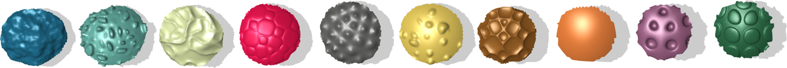

title:  A Dirac Operator for Extrinsic Shape Analysis
author: Hsueh-Ti Derek Liu, Alec Jacobson, Keenan Crane  
html header: <meta property="og:image" content="http://www.dgp.toronto.edu/projects/dirac/dirac-teaser.png" />
<meta property="og:description" content="The eigenfunctions and eigenvalues of
the Laplace-Beltrami operator have proven to be a powerful tool for digital
geometry processing, providing a description of geometry that is essentially
independent of coordinates or the choice of discretization. However, since
Laplace-Beltrami is purely intrinsic it struggles to capture important
phenomena such as extrinsic bending, sharp edges, and fine surface texture. We
introduce a new extrinsic differential operator called the relative Dirac
operator, leading to a family of operators with a continuous trade-off between
intrinsic and extrinsic features. Previous operators are either fully or
partially intrinsic. In contrast, the proposed family spans the entire
spectrum: from completely intrinsic (depending only on the metric) to
completely extrinsic (depending only on the Gauss map). By adding an infinite
potential well to this (or any) operator we can also robustly handle surface
patches with irregular boundary. We explore use of these operators for a
variety of shape analysis tasks, and study their performance relative to
operators previously found in the geometry processing literature." />
css: style.css

# A Dirac Operator for Extrinsic Shape Analysis _SGP 2017_

<div class=authors>

Hsueh-Ti Derek Liu¹, Alec Jacobson², Keenan Crane¹  

¹Carnegie Mellon University, ²University of Toronto

</div>

![Not all differential operators encode the same information about shape.  Here
  we visualize eigenfunctions of Laplace-Beltrami _(left)_ which ignores
  extrinsic bending, and our relative Dirac operator _(right)_ which
  ignores intrinsic stretching.  In between is a continuous spectrum of
  operators that provide a trade off between intrinsic and extrinsic features.
  _Bottom:_ These operators yield very different shape descriptors, here
  emphasizing either a pointy claw with large Gauss curvature _(left)_
  or the flat back of a shell with small mean curvature
  _(right)_.](dirac-teaser.png)

## Abstract

The eigenfunctions and eigenvalues of the Laplace-Beltrami operator have proven
to be a powerful tool for digital geometry processing, providing a description
of geometry that is essentially independent of coordinates or the choice of
discretization. However, since Laplace-Beltrami is purely intrinsic it
struggles to capture important phenomena such as extrinsic bending, sharp
edges, and fine surface texture. We introduce a new extrinsic differential
operator called the _relative Dirac operator_, leading to a family of operators
with a continuous trade-off between intrinsic and extrinsic features. Previous
operators are either fully or partially intrinsic. In contrast, the proposed
family spans the entire spectrum: from completely intrinsic (depending only on
the metric) to completely extrinsic (depending only on the Gauss map). By
adding an infinite potential well to this (or any) operator we can also
robustly handle surface patches with irregular boundary. We explore use of
these operators for a variety of shape analysis tasks, and study their
performance relative to operators previously found in the geometry processing
literature.

## Downloads

 - [Paper](a-dirac-operator-for-extrinsic-shape-analysis-objects-sgp-2017-liu-et-al.pdf)
 - [Paper (low res)](a-dirac-operator-for-extrinsic-shape-analysis-objects-sgp-2017-compressed-liu-et-al.pdf)
 - [Slides](a-dirac-operator-for-extrinsic-shape-analysis-objects-sgp-2017-slides.pdf)
 - [Code in gptoolbox](http://github.com/alecjacobson/gptoolbox), see
   `dirac_operator.m`, `relative_dirac_operator.m` and `dirac_eigs.m`
 - [Patch Dataset](patch-dataset.zip)

## BibTeX

```
@article{Liu:Dirac:2017,
  title = {A Dirac Operator for Extrinsic Shape Analysis},
  author = {Hsueh-Ti Derek Liu, Alec Jacobson, Keenan Crane},
  year = {2017},
  journal = {Computer Graphics Forum}, 
}
```

## Patch Dataset

[](patch-dataset.zip)

To enable further testing of methods for geometric texture classification, we have
released our [patch dataset](patch-dataset.zip).


## Acknowledgements 

Lucas Schuermann participated in an early version of this project.  This work
was funded in part by NSF Award 1319483 (under an REU supplement), NSERC
Discovery Grants (RGPIN-2017-05235 & RGPAS-2017-507938), the Connaught Fund, a
gift from Adobe Systems Inc., and a gift from Autodesk, Inc.
